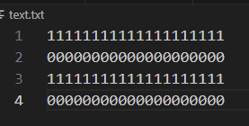

# 42_get_next_line
## What is this project all about?
Get next line is a our first project to ask us to open a file, read the file and retrieve the data inside line by line and storage into the computer and be able to call it several times to finish reading the file.

## What is the key learnings of this project?
What has been descpribed in the project pdf:
- learning of new C library funcion: open, read and close
- learning of static variable\

I personally learned something more
- differences of heap / stack variables
## Uniqueness of my approach
### leaks or not leaks?
It's been a hot disucssion (Heslink) in our campus about this project especially regarding the memory leaks. If we didn't finish reading the file and stops the program in the middle, should there be leaks? My takeout of this question is we should not. Because we can not assume what the user will do with the functions and out of the best secured practice, we should prevent leaks by our own functions if possible.
### stack or heap?
To understand why there is leaks if we exit the program before we finish reading the function, it has a lot to do with how we declare and initiate the string array that we use to storage the remaining data.\
\
Generally there are 2 ways (to my limited understaning of C) of initiating a string array, using pointers or using an array. With pointers, because we are at 42 school and we are not allowed to perform declaration and initialization at the same time, we need to do it in 2 lines of code. That lead us to the only solution, **malloc**.
```
static char	*buffer;
buffer = malloc(sizeof(BUFFER_SIZE+1) * sizeof(char));
free(buffer); //when finish reading the file
```
With every malloc, there should a free as a couple(I said).  And since we are not able to pass buffer into the main function due to limitation of the prototype, that will lead us to a weird situation is that when there is still data inside buffer we can not free it.Looking at the cause of memory leaks, one of them are:
>When the program terminates abruptly and the allocated memory is not freed or if any part of code prevents the call of free then memory leaks may happen.
>

That's why I initiate the **static variable (buffer)** into stack not into heap. More into human-understanable language, **I initiated the static variable as an array not as a pointer.** `static char	buffer[BUFFER_SIZE + 1]; `  So no matter when we exit the program, as long as the program is terminated, no leaks are possible.
### The real life example
To make things easier to understand, for example, I have a original file that contains 4 lines of data.\
\
If we initiate the static variable into heap (a.k.a using **Malloc**) that we use to storage the *leftover* over data, and we only call the function get_next_line 2 times or 3 times, that variable will not be freed anywhere in the function or in the main. \
\
With my approach, specifically initate the static variable as an array that storages in stack, once we exit the program, this part of the data will be ereased for good. So no leaks are possible no matter we finish reading the file or not. You can see the leak summary below of the results when we only read 2 lines of data of a 4-line-long file.\

### Limitations of this approach
Nothing is 100% flawless, theoritically stack could more likely has less memory than heap.
> Memory shortage problem is more likely to happen in stack whereas the main issue in heap memory is fragmentation.
>
So this case, since we are compiling the program with any buffer size we want, if we are compiling with insanely big number of buffer size, it could possibly crash the program or create segmentation fault.